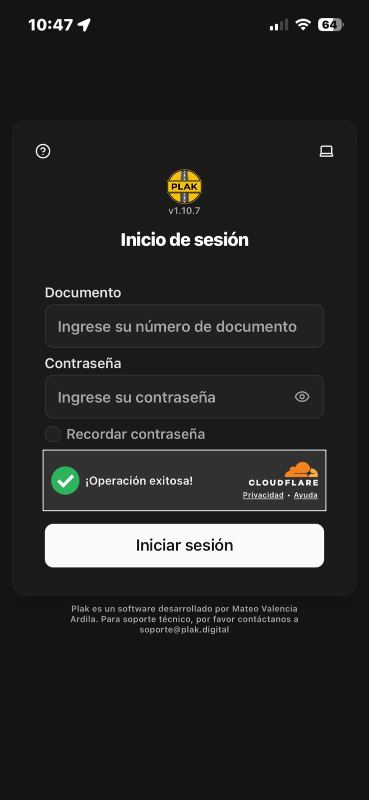
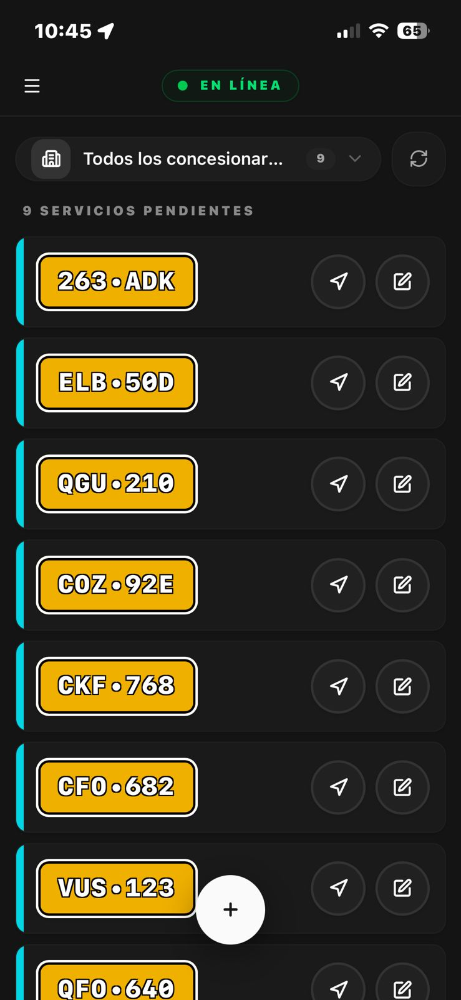
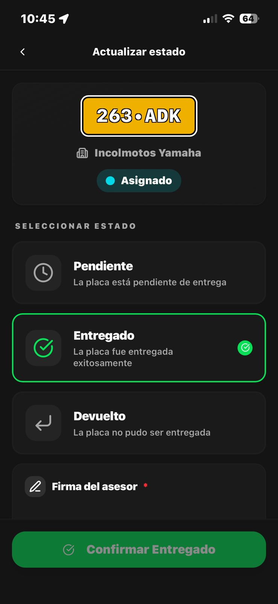
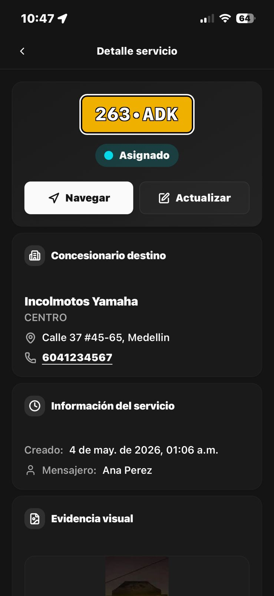
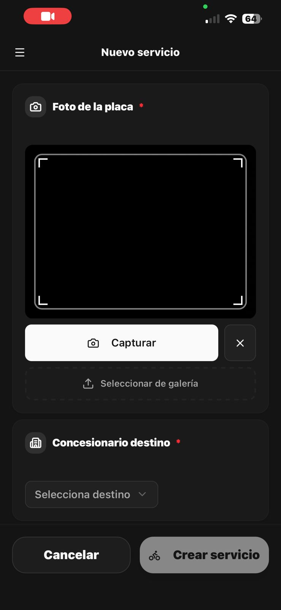
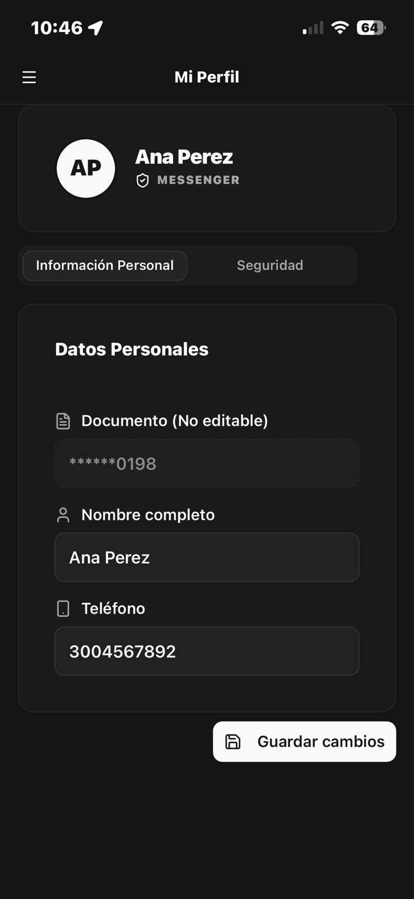
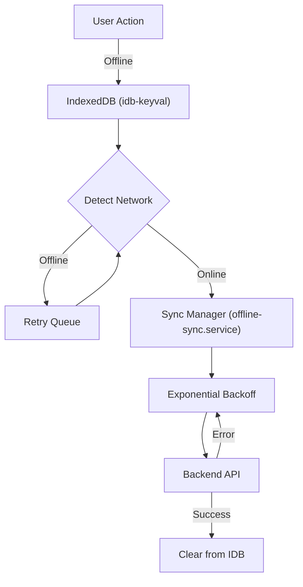

> **Copyright (C) 2026 Mateo Valencia Ardila. All rights reserved. The source code for this application is protected by copyright laws. DNDA Registration No. 13-108-139. Copying, distributing, or modifying this application without express authorization is strictly prohibited.**

<div align="center">

# PLAK - Messenger Frontend


[](https://react.dev/)
[](https://www.typescriptlang.org/)
[](https://vite.dev/)
[](https://tailwindcss.com/)
[](https://vitest.dev/)
[](https://web.dev/progressive-web-apps/)
[](LICENSE)

**High-engineering platform for messenger management.**

[🇪🇸 Versión en Español](README.md) • [Overview](#overview) • [Screenshots](#screenshots) • [Features](#key-features) • [Testing](#quality-strategy--testing) • [Tech Stack](#tech-stack) • [Architecture](#project-architecture) • [Installation](#installation--deployment) • [Security](#security) • [Tips](#operation-tips-mobile) • [Contact](#contact)

</div>

---

## Overview
**PLAK Messenger Frontend** is the mission-critical user interface for urban logistics operations. Built with enterprise-grade architecture, it orchestrates real-time fleet management while ensuring business continuity even under adverse network conditions.

### Native App (Android)
The messenger experience is fully optimized as a standalone Android application. By installing the native APK, users get:
- **Instant Access**: Launch directly from the home screen.
- **Immersive Experience**: True full-screen interface without browser navigation bars.
- **Reliable Operation**: Persistent background tracking and seamless offline synchronization tailored for the device.

### Two Optimized Experiences
| **Command Center** | **Field App** |
|:---|:---|
| Admin Dashboard for operations control | Progressive Web App for messengers |
| Real-time fleet monitoring on Google Maps | Installable on any mobile device |
| Dealership & employee management | Offline-capable with auto-sync |
| Service auditing with digital evidence | Digital signature & photo capture |

---

## Screenshots

### Admin Dashboard
| Login | Live Monitoring |
|:---:|:---:|
|  |  |
| *Administrative system access* | *Real-time fleet position on Google Maps* |

| Service Management | Service Details |
|:---:|:---:|
|  |  |
| *Listing and filtering of services* | *Detailed timeline with photo evidence* |

| Employees | Dealerships |
|:---:|:---:|
|  |  |
| *Staff management* | *Dealership administration* |

### Messenger PWA
| Login | Assigned Services | Update Status |
|:---:|:---:|:---:|
|  |  |  |
| *Messenger access* | *Assigned deliveries list* | *Status change* |

| Service Details | New Service | My Profile |
|:---:|:---:|:---:|
|  |  |  |
| *Complete information* | *Create Service* | *Date Profile* |

---

## Key Features

### Robustness & Resilience (Offline-First)
| Feature | Description |
|:---|:---|
| **Smart Synchronization** | *Store-and-Forward* pattern implementation. Offline actions are persisted in `IndexedDB` and automatically retried. |
| **Event-Driven Architecture** | Elimination of constant polling via `offline-actions-updated` events, drastically reducing latency and battery consumption. |
| **Smart Last-Location** | Optimized tracking strategy that only queues the most recent location when offline, preventing bandwidth waste and "teleportation" artifacts upon reconnection. |
| **Service Workers** | Strategic caching of assets and API responses via VitePWA for instant loading under any network condition. |
| **Bundle Optimization** | Continuous bundle size analysis with `rollup-plugin-visualizer` to ensure performance on mid/low-range devices. |

#### Offline Synchronization Flow


### Geospatial Engineering
| Feature | Description |
|:---|:---|
| **Live Tracking** | Bidirectional WebSocket communication via STOMP/SockJS for sub-second position updates. |
| **Advanced Markers API** | High-performance Google Maps rendering, supporting thousands of simultaneous entities without FPS degradation. |
| **Resilient Geocoding** | Queue system for address resolution that respects Google API rate limits. |

### User Experience (UX)
| Feature | Description |
|:---|:---|
| **Responsive Design** | Fluid interface from 4K monitors to 5" mobile devices, built with Tailwind CSS v4.2. |
| **Dark/Light Mode** | Native theme support with system preference detection and persistent user choice. |
| **Pagination & Search** | Efficient management of large data volumes through server-side pagination and Full-Text search. |
| **Evidence Capture** | Vector digital signature and **Native WebP Optimization Pipeline** with source compression for maximum performance. |
| **My Profile** | Centralized management of personal data and security with sensitive document masking. |
| **Speech-to-Text** | Google Cloud Speech-to-Text integration for dictating service observations, ensuring high accuracy and reliability across all devices. |
| **Safe Area Support** | Native adaptation for *Notches* and *Dynamic Islands* via `@capacitor-community/safe-area`, ensuring an immersive experience without UI clipping. |


---

## Quality Strategy & Testing
This project follows the **"Testing Trophy"** methodology, prioritizing deployment confidence over vanity coverage metrics.

```
    ╭────────────────────╮    
    │  E2E (Playwright)  │  ← Full user flows
    ├────────────────────┤
    │  Integration (MSW) │  ← Component + API layer
    ├────────────────────┤
    │   Unit (Vitest)    │  ← Business logic (~89% coverage)
    ├────────────────────┤
    │  Static (TS/ESLint)│  ← Compile-time safety
    ╰────────────────────╯
```

| **E2E** | `Playwright` | Critical flow tests (Login, Delivery, Offline) with security bypass (Turnstile) |
| **Integration** | `Vitest` + `MSW` | Full-page tests with mocked network layer via Mock Service Worker |
| **Unit** | `Vitest` | Business logic (~89% coverage in services), utilities, and complex hooks |
| **Static** | `ESLint`, `TypeScript` | Strict type checking and linting rules |

### Running Tests
```bash
# Unit & Integration tests (Vitest)
npm run test:run

# Coverage report
npm run test:coverage

# E2E tests (Playwright)
npx playwright test

# E2E tests with UI
npx playwright test --ui
```

---

## Tech Stack
The architecture is designed for **scalability**, **maintainability**, and **long-term performance**.

| Category | Technologies | Purpose |
|:---|:---|:---|
| **Core** | `React 19.2`, `TypeScript 5.9` | Concurrent features + strict type safety |
| **Build** | `Vite 7.3` | Lightning-fast HMR and optimized builds |
| **Styling** | `Tailwind CSS 4.2`, `Shadcn/UI` | Utility-first CSS with accessible component library |
| **State** | `Context API`, `Custom Hooks` | Global state management + shared business logic |
| **Forms** | `React Hook Form`, `Zod 4` | High-performance forms with schema validation |
| **PWA** | `vite-plugin-pwa`, `idb-keyval` | Offline capabilities and local persistence |
| **Mobile** | `Capacitor 8` | Native Android app generation and next-gen native APIs access |
| **Maps** | `@react-google-maps/api` | Deep integration with Google Maps Platform |
| **Real-time** | `@stomp/stompjs` | WebSocket messaging for live tracking |
| **Animation** | `Framer Motion` | Fluid animations and transitions |
| **Charts** | `Recharts` | Data visualization components |

---

## Project Architecture
The codebase follows **Clean Architecture** principles adapted for frontend development:

```
src/
├── components/          # UI Building Blocks (115+ components)
│   ├── ui/              # Base components (Shadcn/UI)
│   └── ...              # Feature-specific components
├── config/              # Application Configuration
├── context/             # Global State Providers (Auth, Network, StatusColor)
├── hooks/               # Custom React Hooks (16 hooks)
├── layouts/             # Page Layout Components
├── lib/                 # Utility Libraries
├── pages/               # Route Page Components (31 pages)
├── routes/              # Application Routing
├── schemas/             # Zod Validation Schemas
├── services/            # API & Infrastructure Services
├── styles/              # Global Styles
├── test/                # Test Configuration & Mocks (MSW)
├── types/               # TypeScript Type Definitions
└── utils/               # Utility Functions
```

---

## Installation & Deployment

### Prerequisites
| Requirement | Version |
|:---|:---|
| Node.js | v20.0.0+ (LTS recommended) |
| npm | v10+ |
| Google Maps API Key | Required for maps functionality |

### Quick Start (Docker)
If you have the backend repository in the same root folder, you can spin up the entire ecosystem (Frontend + Backend + DB) using Docker:

1. Go to the backend folder: `cd ../messenger-backend`
2. Run: `docker-compose -f docker-compose.local.yml up --build`

This will build the frontend and serve it at `http://localhost`.

### Development with Hot Reloading (Docker)
For active development with automatic code reloading:

```bash
cd ../messenger-backend
docker-compose -f docker-compose.dev.yml up --build
```

The frontend dev server (Vite HMR) will be available at `http://localhost:5173` — changes are reflected instantly on save.

### Local Development (Manual)
```bash
# 1. Clone the repository
git clone https://github.com/fttmatteo/messenger-frontend.git
cd messenger-frontend

# 2. Install dependencies
npm install

# 3. Configure environment variables
cp .env.example .env
# Edit .env with your configuration

# 4. Start development server
npm run dev
```

### Environment Variables
Create a `.env` file in the project root:

```env
# API Configuration
VITE_API_URL=http://localhost:8080/api

# Google Maps
VITE_GOOGLE_MAPS_API_KEY=your_google_maps_api_key
VITE_GOOGLE_MAPS_MAP_ID=your_google_maps_map_id

# Cloudflare Turnstile (Bot Protection)
VITE_TURNSTILE_SITE_KEY=your_turnstile_site_key
```

### Available Scripts
| Script | Description |
|:---|:---|
| `npm run dev` | Start development server with HMR |
| `npm run dev:staging` | Start dev server with staging config |
| `npm run build` | Build for production |
| `npm run build:staging` | Build for staging environment |
| `npm run preview` | Preview production build locally |
| `npm run lint` | Run ESLint code quality checks |
| `npm run test` | Run Vitest in watch mode |
| `npm run test:run` | Run Vitest once |
| `npm run test:ui` | Open Vitest UI |
| `npm run test:coverage` | Generate coverage report |

---

## Security
| Feature | Implementation |
|:---|:---|
| **JWT Authentication** | Automatic token rotation via Axios interceptors with refresh token support |
| **XSS Prevention** | React's built-in escaping + strict Content Security Policy |
| **Route Guards** | Role-based route protection (Admin vs Messenger) at router level |
| **Solo HTTPS** | Enforced secure connections in production |
| **Input Validation** | All user inputs validated with Zod schemas (aligned with backend, e.g., min 6 chars for passwords) |
| **Data Masking** | Automatic obfuscation of sensitive documents in the UI (only last 4 digits visible) |
| **Bot Protection** | Cloudflare Turnstile integrated into all login flows |
| **Rate Limiting** | Client-side handling of 429 errors from the backend |
| **Public UUIDs** | Use of UUID v4 for all entity references to prevent ID enumeration and improve offline sync |

---

## Operation Tips (Mobile)
To ensure the best experience on Android devices:
*   **Battery Optimization**: It is mandatory to disable "Battery Optimization" for PLAK in the system settings. This allows GPS tracking to function correctly in the background.
*   **Location Permissions**: Select "Allow all the time" to ensure tracking doesn't stop when the app is minimized.
*   **Power Saving Mode**: Avoid extreme "Power Saving" modes, as they may limit the update frequency of WebSockets.

---

## Contact
For inquiries about this project:
- **Repository**: `messenger-frontend`
- **Author**: [Mateo Valencia Ardila](https://github.com/fttmatteo)
- **Email**: [contacto@plak.digital](mailto:contacto@plak.digital)
- **Website**: [plak.digital](https://www.plak.digital)

> **Copyright (C) 2026 Mateo Valencia Ardila. All rights reserved. The source code for this application is protected by copyright laws. DNDA Registration No. 13-108-139. Copying, distributing, or modifying this application without express authorization is strictly prohibited.**