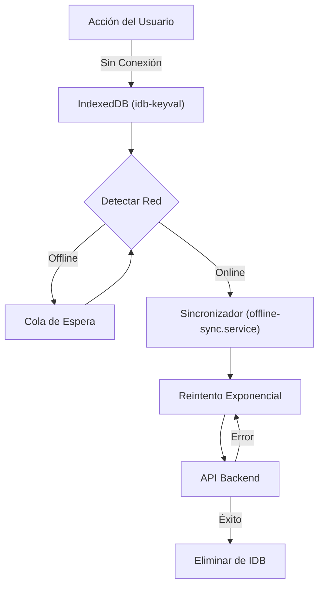

> **Copyright (C) 2026 Mateo Valencia Ardila. Todos los derechos reservados. El código fuente de esta aplicación está protegido por las leyes de derechos de autor. Registro DNDA No. 13-108-139. Queda estrictamente prohibida su copia, distribución o modificación sin autorización expresa.**

<div align="center">

# PLAK - Messenger Frontend


[](https://react.dev/)
[](https://www.typescriptlang.org/)
[](https://vite.dev/)
[](https://tailwindcss.com/)
[](https://vitest.dev/)
[](https://web.dev/progressive-web-apps/)
[](LICENSE)

**Plataforma de alta ingeniería para gestión de mensajería.**

[🇺🇸 English Version](README.en.md) • [Descripción](#descripción-general) • [Características](#características-principales) • [Calidad](#estrategia-de-calidad-y-pruebas) • [Tecnologías](#stack-tecnológico) • [Arquitectura](#arquitectura-del-proyecto) • [Instalación](#instalación-y-despliegue) • [Seguridad](#seguridad) • [Tips](#tips-de-operación-móvil) • [Contacto](#contacto)

</div>

---

## Descripción General
**PLAK Messenger Frontend** es la interfaz de usuario crítica para operaciones de logística urbana. Construida con arquitectura empresarial, orquesta la gestión de flotas en tiempo real mientras asegura la continuidad del negocio incluso bajo condiciones de red adversas.

### App Nativa (Android)
La experiencia del transportista está completamente optimizada como una aplicación independiente para Android. Al instalar el APK nativo, los usuarios obtienen:
- **Acceso Instantáneo**: Inicio directo desde la pantalla principal del teléfono.
- **Experiencia Inmersiva**: Interfaz a pantalla completa real, sin barras de navegación del navegador que estorben.
- **Operación Confiable**: Seguimiento en segundo plano persistente y sincronización offline perfectamente adaptada al dispositivo.

### Dos Experiencias Optimizadas
| **Centro de Comando** | **App de Campo** |
|:---|:---|
| Dashboard Administrativo para control de operaciones | Aplicación Web Progresiva para transportistas |
| Monitoreo de flota en tiempo real con Google Maps | Instalable en cualquier dispositivo móvil |
| Gestión de concesionarios y empleados | Capaz de trabajar offline con auto-sincronización |
| Auditoría de servicios con evidencia digital | Firma digital y captura de fotos |

---

## Características Principales

### Robustez y Resiliencia (Offline-First)
| Característica | Descripción |
|:---|:---|
| **Sincronización Inteligente** | Implementación del patrón *Store-and-Forward*. Las acciones offline se persisten en `IndexedDB` y se reintentan automáticamente. |
| **Arquitectura Event-Driven** | Eliminación de *polling* constante mediante eventos `offline-actions-updated`, reduciendo drásticamente latencia y consumo de batería. |
| **Última Ubicación Inteligente** | Estrategia de rastreo optimizada que solo encola la ubicación más reciente cuando está offline, evitando desperdicio de ancho de banda y "teletransportes" al reconectar. |
| **Service Workers** | Caché estratégica de assets y respuestas de API mediante VitePWA para carga instantánea bajo cualquier condición de red. |
| **Optimización de Bundle** | Análisis continuo del tamaño del bundle con `rollup-plugin-visualizer` para asegurar rendimiento en dispositivos de gama media/baja. |

#### Flujo de Sincronización Offline


### Ingeniería Geoespacial
| Característica | Descripción |
|:---|:---|
| **Rastreo en Vivo** | Comunicación bidireccional WebSocket via STOMP/SockJS para actualizaciones de posición sub-segundo. |
| **Advanced Markers API** | Renderizado de alto rendimiento en Google Maps, soportando miles de entidades simultáneas sin degradación de FPS. |
| **Geocodificación Resiliente** | Sistema de colas para resolución de direcciones que respeta los límites de la API de Google. |

### Experiencia de Usuario (UX)
| Característica | Descripción |
|:---|:---|
| **Diseño Responsivo** | Interfaz fluida desde monitores 4K hasta dispositivos móviles de 5", construida con Tailwind CSS v4.2. |
| **Modo Oscuro/Claro** | Soporte nativo de temas con detección de preferencia del sistema y elección persistente del usuario. |
| **Paginación y Búsqueda** | Gestión eficiente de grandes volúmenes de datos mediante paginación del lado del servidor y búsqueda Full-Text. |
| **Captura de Evidencia** | Firma digital vectorial y **Pipeline de Optimización WebP dual** (Compresión en origen + Refuerzo en servidor) para máximo ahorro de datos. |
| **Rendimiento Adaptativo** | Integración de **LazyMotion** y memoización selectiva de componentes críticos (`ServiceCard`) para scroll fluido en dispositivos de gama media. |
| **Mi Perfil** | Gestión centralizada de datos personales y seguridad con enmascaramiento de documentos sensibles. |
| **Safe Area Support** | Adaptación nativa para *Notches* y *Dynamic Islands* mediante `@capacitor-community/safe-area`, garantizando una experiencia inmersiva sin recortes de UI. |

---

## Estrategia de Calidad y Pruebas
Este proyecto sigue la metodología **"Testing Trophy"**, priorizando la confianza en el despliegue sobre métricas de cobertura vanidosas.

```
    ╭──────────────────────╮
    │  E2E (Playwright)    │  ← Flujos de usuario completos
    ├──────────────────────┤
    │  Integración (MSW)   │  ← Componente + capa API
    ├──────────────────────┤
    │   Unitarias (Vitest) │  ← Lógica de negocio (~89% cobertura)
    ├──────────────────────┤
    │  Estático (TS/ESLint)│  ← Seguridad en compilación
    ╰──────────────────────╯
```

| **E2E** | `Playwright` | Pruebas de flujos críticos (Login, Entrega, Offline) con bypass de seguridad (Turnstile) |
| **Integración** | `Vitest` + `MSW` | Pruebas de página completa con capa de red mockeada via Mock Service Worker |
| **Unitarias** | `Vitest` | Lógica de negocio (~89% de cobertura en servicios), utilidades y hooks complejos |
| **Estático** | `ESLint`, `TypeScript` | Verificación estricta de tipos y reglas de linting |

### Ejecutar Pruebas
```bash
# Pruebas unitarias e integración (Vitest)
npm run test:run

# Reporte de cobertura
npm run test:coverage

# Pruebas E2E (Playwright)
npx playwright test

# Pruebas E2E con UI
npx playwright test --ui
```

---

## Stack Tecnológico
La arquitectura está diseñada para **escalabilidad**, **mantenibilidad** y **rendimiento a largo plazo**.

| Categoría | Tecnologías | Propósito |
|:---|:---|:---|
| **Core** | `React 19.2`, `TypeScript 5.9` | Características concurrentes + tipado estricto |
| **Build** | `Vite 7.3` | HMR ultrarrápido y builds optimizadas |
| **Estilos** | `Tailwind CSS 4.2`, `Shadcn/UI` | CSS utility-first con librería de componentes accesibles |
| **Estado** | `Context API`, `Custom Hooks` | Gestión de estado global y lógica de negocio compartida |
| **Formularios** | `React Hook Form`, `Zod 4` | Formularios de alto rendimiento con validación de esquemas |
| **PWA** | `vite-plugin-pwa`, `idb-keyval` | Capacidades offline y persistencia local |
| **Mobile** | `Capacitor 8` | Generación de la aplicación nativa para Android y acceso a sus APIs de última generación |
| **Mapas** | `@react-google-maps/api` | Integración profunda con Google Maps Platform |
| **Tiempo Real** | `@stomp/stompjs` | Mensajería WebSocket para rastreo en vivo |
| **Animaciones** | `Framer Motion` | Animaciones y transiciones fluidas |
| **Gráficos** | `Recharts` | Componentes de visualización de datos |

---

## Arquitectura del Proyecto
El código sigue principios de **Clean Architecture** adaptados para desarrollo frontend:

```
src/
├── components/          # Bloques de Construcción UI (115+ componentes)
│   ├── ui/              # Componentes base (Shadcn/UI)
│   └── ...              # Componentes específicos por feature
├── config/              # Configuración de la Aplicación
├── context/             # Proveedores de Estado Global (Auth, Network, StatusColor)
├── hooks/               # Custom React Hooks (16 hooks)
├── layouts/             # Componentes de Layout de Página
├── lib/                 # Librerías de Utilidades
├── pages/               # Componentes de Página de Ruta (31 páginas)
├── routes/              # Enrutamiento de la Aplicación
├── schemas/             # Esquemas de Validación Zod
├── services/            # Servicios de API e Infraestructura
├── styles/              # Estilos Globales
├── test/                # Configuración de Pruebas y Mocks (MSW)
├── types/               # Definiciones de Tipos TypeScript
└── utils/               # Funciones Utilitarias
```

---

## Instalación y Despliegue

### Prerrequisitos
| Requerimiento | Versión |
|:---|:---|
| Node.js | v20.0.0+ (LTS recomendado) |
| npm | v10+ |
| Google Maps API Key | Requerido para funcionalidad de mapas |

### Inicio Rápido (Docker)
Si tienes el repositorio del backend en la misma carpeta raíz, puedes levantar todo el ecosistema (Frontend + Backend + DB) usando Docker:

1. Ve a la carpeta del backend: `cd ../messenger-backend`
2. Ejecuta: `docker-compose -f docker-compose.local.yml up --build`

Esto compilará el frontend y lo servirá en `http://localhost`.

### Desarrollo con Hot Reloading (Docker)
Para desarrollo activo con recarga automática de código:

```bash
cd ../messenger-backend
docker-compose -f docker-compose.dev.yml up --build
```

El servidor de desarrollo del frontend (Vite HMR) estará disponible en `http://localhost:5173` — los cambios se reflejan instantáneamente al guardar.

### Desarrollo Local (Manual)
```bash
# 1. Clonar el repositorio
git clone https://github.com/fttmatteo/messenger-frontend.git
cd messenger-frontend

# 2. Instalar dependencias
npm install

# 3. Configurar variables de entorno
cp .env.example .env
# Editar .env con tu configuración

# 4. Iniciar servidor de desarrollo
npm run dev
```

### Variables de Entorno
Crea un archivo `.env` en la raíz del proyecto:

```env
# Configuración de API
VITE_API_URL=http://localhost:8080/api

# Google Maps
VITE_GOOGLE_MAPS_API_KEY=tu_api_key_de_google_maps
VITE_GOOGLE_MAPS_MAP_ID=tu_map_id_de_google_maps

# Cloudflare Turnstile (Protección contra Bots)
VITE_TURNSTILE_SITE_KEY=tu_turnstile_site_key
```

### Scripts Disponibles
| Script | Descripción |
|:---|:---|
| `npm run dev` | Iniciar servidor de desarrollo con HMR |
| `npm run dev:staging` | Iniciar servidor dev con config de staging |
| `npm run build` | Compilar para producción |
| `npm run build:staging` | Compilar para ambiente de staging |
| `npm run preview` | Previsualizar build de producción localmente |
| `npm run lint` | Ejecutar verificación de calidad ESLint |
| `npm run test` | Ejecutar Vitest en modo watch |
| `npm run test:run` | Ejecutar Vitest una vez |
| `npm run test:ui` | Abrir UI de Vitest |
| `npm run test:coverage` | Generar reporte de cobertura |

---

## Seguridad
| Característica | Implementación |
|:---|:---|
| **Autenticación JWT** | Rotación automática de tokens via interceptores de Axios con **Persistencia Híbrida Segura**: Cookies `HttpOnly` (Web) y `@capacitor/preferences` (App Nativa). |
| **Prevención XSS** | Escapado integrado de React + **Content Security Policy (CSP)** estricto que bloquea inyecciones de scripts no autorizados. |
| **Guardias de Ruta** | Protección de rutas basada en roles (Admin vs Transportista) a nivel de router |
| **Solo HTTPS** | Conexiones seguras forzadas en producción |
| **Validación de Entrada** | Todas las entradas de usuario validadas con esquemas Zod (alineadas con el backend, ej: mín. 6 caracteres para claves) |
| **Enmascaramiento de Datos** | Ofuscación automática de documentos sensibles en la interfaz (solo últimos 4 dígitos visibles) |
| **Protección contra Bots** | Cloudflare Turnstile integrado en todos los flujos de login |
| **Rate Limiting** | Manejo del lado del cliente de errores 429 desde el backend |
| **UUIDs Públicos** | Uso de UUID v4 para todas las referencias de entidades para prevenir enumeración de IDs y mejorar la sincronización offline |

---

## Tips de Operación (Móvil)
Para garantizar la mejor experiencia en dispositivos Android:
*   **Optimización de Batería**: Es mandatorio desactivar la "Optimización de Batería" para PLAK en los ajustes del sistema. Esto permite que el rastreo GPS funcione correctamente en segundo plano.
*   **Permisos de Ubicación**: Seleccionar "Permitir siempre" para asegurar que el tracking no se detenga al minimizar la aplicación.
*   **Modo de Ahorro**: Evitar el "Modo de Ahorro de Energía" extremo, ya que puede limitar la frecuencia de actualización de los WebSockets.

---

## Contacto
Para consultas sobre este proyecto:
- **Repositorio**: `messenger-frontend`
- **Autor**: [Mateo Valencia Ardila](https://github.com/fttmatteo)
- **Email**: [contacto@plak.digital](mailto:contacto@plak.digital)
- **Sitio Web**: [plak.digital](https://plak.digital)

> **Copyright (C) 2026 Mateo Valencia Ardila. Todos los derechos reservados. El código fuente de esta aplicación está protegido por las leyes de derechos de autor. Registro DNDA No. 13-108-139. Queda estrictamente prohibida su copia, distribución o modificación sin autorización expresa.**
