> **Copyright (C) 2026 Mateo Valencia Ardila. All rights reserved. Confidential and Proprietary.**

<div align="center">

# 📱 PLAK - Messenger Frontend

[](https://react.dev/)
[](https://www.typescriptlang.org/)
[](https://vite.dev/)
[](https://tailwindcss.com/)
[](https://playwright.dev/)
[](https://vitest.dev/)
[](https://web.dev/progressive-web-apps/)
[](LICENSE)

**High-engineering platform for messenger management.**

*Robust interface • Offline-First Architecture • Real-time Fleet Tracking • Comprehensive Testing Strategy*

---

[🇪🇸 Versión en Español](README.es.md) • [Features](#-key-features) • [Screenshots](#-screenshots) • [Tech Stack](#-tech-stack) • [Installation](#-installation--deployment) • [Architecture](#-project-architecture)

</div>

---

## 📋 Overview

**PLAK Messenger Frontend** is the mission-critical user interface for urban logistics operations. Built with enterprise-grade architecture, it orchestrates real-time fleet management while ensuring business continuity even under adverse network conditions.

### 🎯 Two Optimized Experiences

| 🖥️ **Command Center** | 📱 **Field App** |
|:---|:---|
| Admin Dashboard for operations control | Progressive Web App for messengers |
| Real-time fleet monitoring on Google Maps | Installable on any mobile device |
| Dealership & employee management | Offline-capable with auto-sync |
| Service auditing with digital evidence | Digital signature & photo capture |

---

## 📸 Screenshots

<details>
<summary><b>🖥️ Admin Dashboard</b> (click to expand)</summary>

| Login | Live Monitoring |
|:---:|:---:|
| 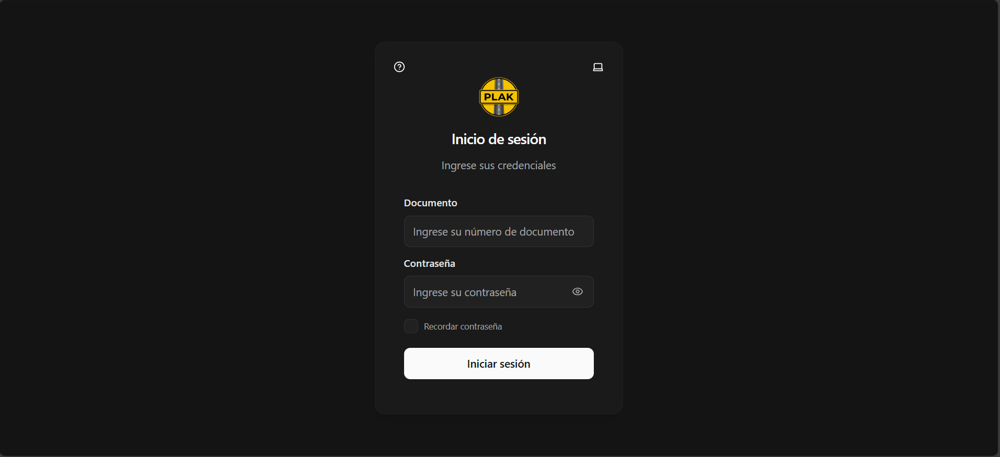 | 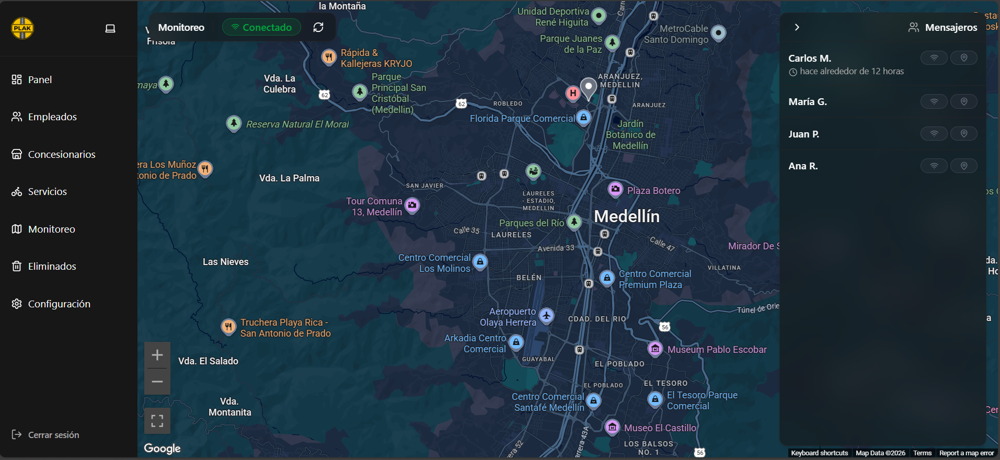 |
| *Administrative system access* | *Real-time fleet position on Google Maps* |

| Service Management | Service Details |
|:---:|:---:|
| 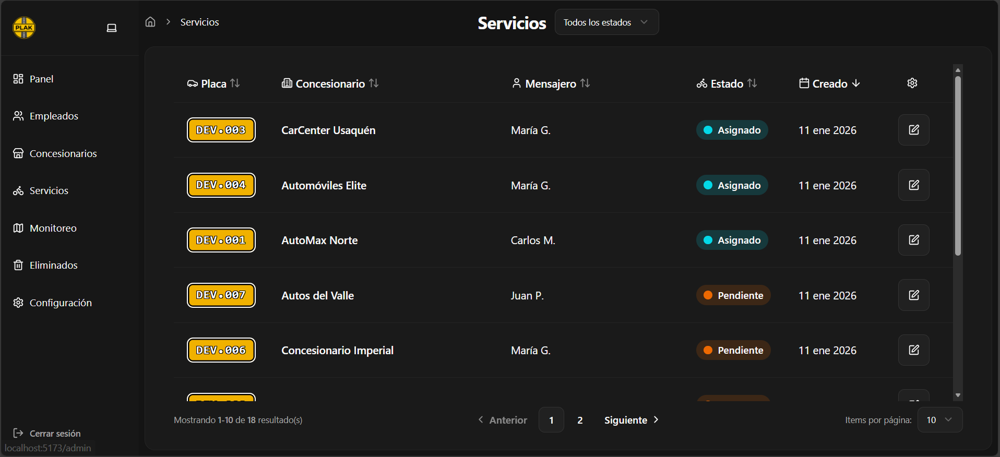 | 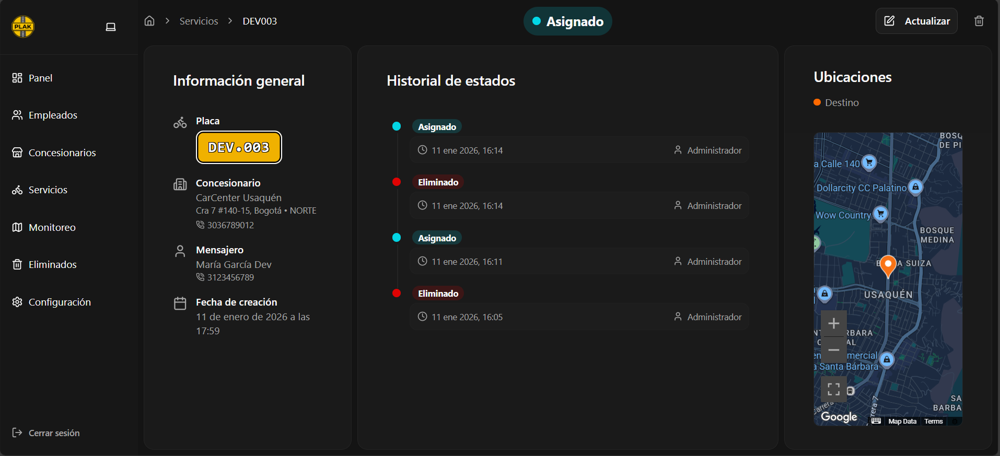 |
| *Listing and filtering of services* | *Detailed timeline with photo evidence* |

| Employees | Dealerships |
|:---:|:---:|
| 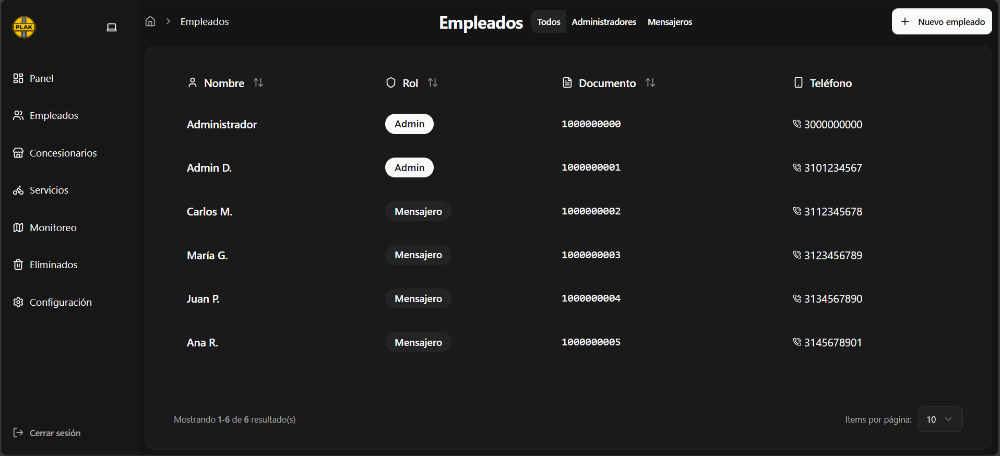 | 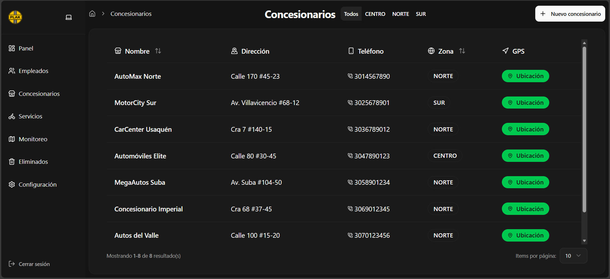 |
| *Staff management* | *Dealership administration* |

</details>

<details>
<summary><b>📱 Messenger PWA</b> (click to expand)</summary>

| Login | Assigned Services | Update Status |
|:---:|:---:|:---:|
| 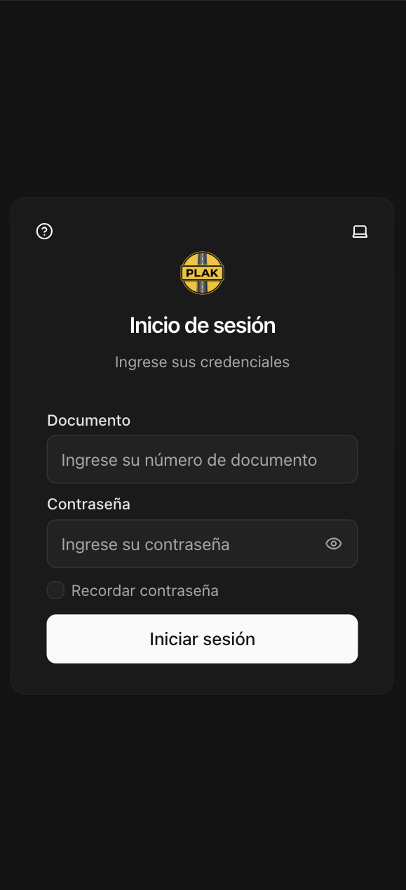 | 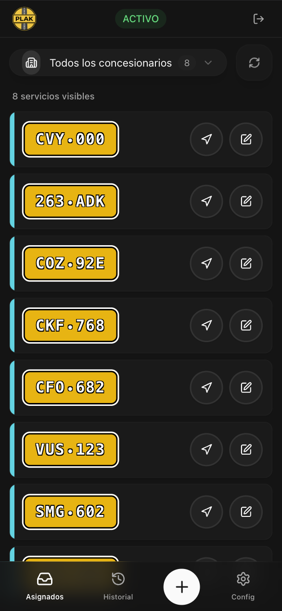 | 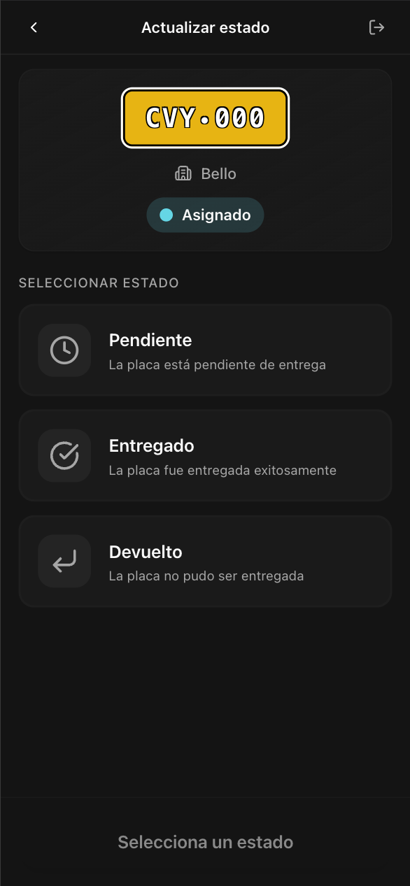 |
| *Messenger access* | *Assigned deliveries list* | *Status change with evidence* |

| Service Details | History | Settings |
|:---:|:---:|:---:|
| 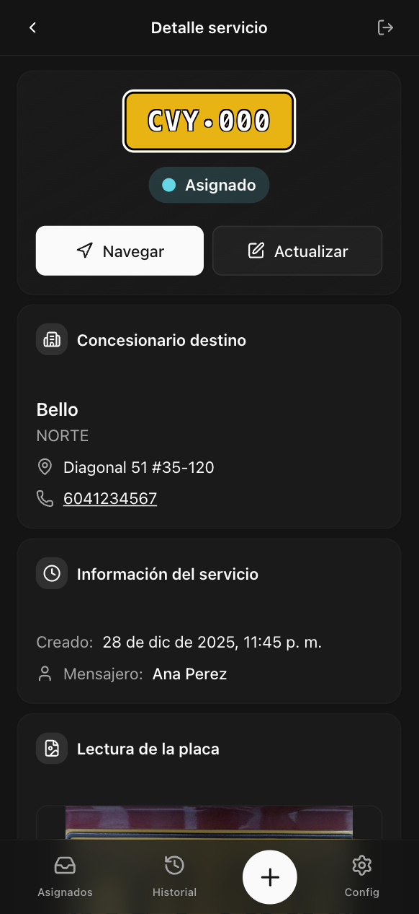 | 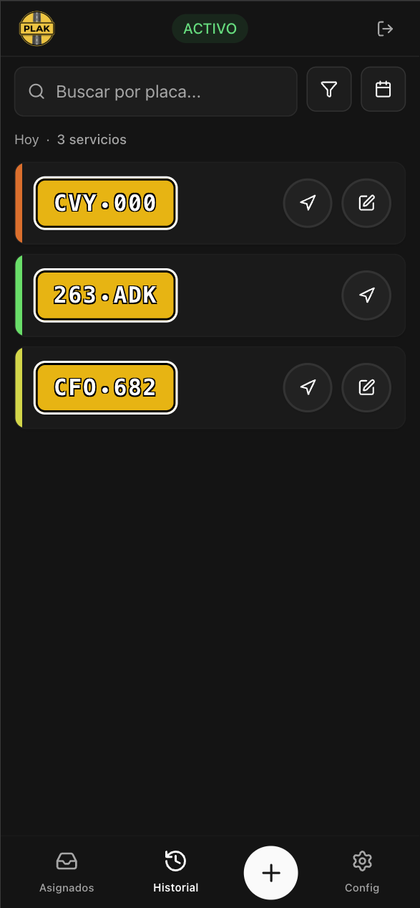 | 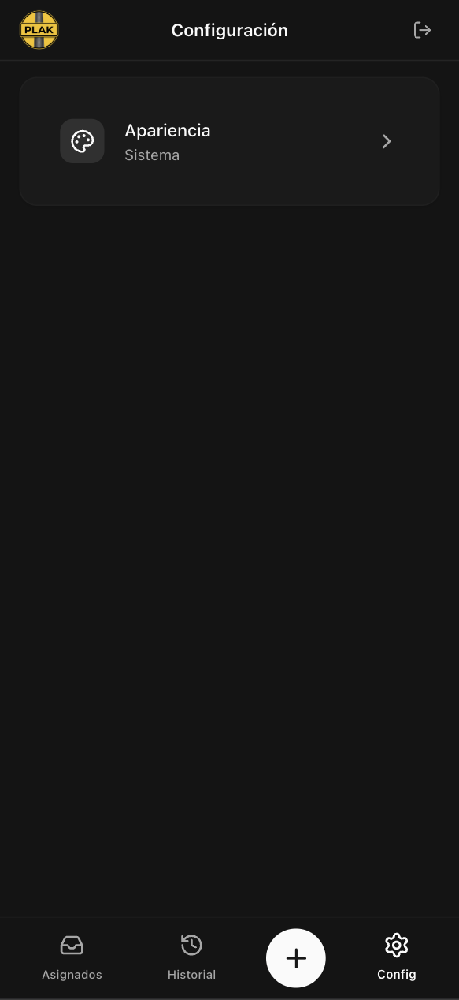 |
| *Complete information & navigation* | *Service status history* | *App preferences* |

</details>

---

## ✨ Key Features

### 🛡️ Robustness & Resilience (Offline-First)

| Feature | Description |
|:---|:---|
| **Smart Synchronization** | *Store-and-Forward* pattern implementation. Actions performed offline are persisted in `IndexedDB` and automatically retried when connection is restored. |
| **Service Workers** | Strategic caching of assets and API responses via VitePWA for instant loading under any network condition. |
| **Bundle Optimization** | Continuous bundle size analysis with `rollup-plugin-visualizer` to ensure performance on mid/low-range devices. |

### 🗺️ Geospatial Engineering

| Feature | Description |
|:---|:---|
| **Live Tracking** | Bidirectional WebSocket communication via STOMP/SockJS for sub-second position updates. |
| **Advanced Markers API** | High-performance Google Maps rendering, supporting thousands of simultaneous entities without FPS degradation. |
| **Resilient Geocoding** | Queue system for address resolution that respects Google API rate limits. |

### 📱 User Experience (UX)

| Feature | Description |
|:---|:---|
| **Responsive Design** | Fluid interface from 4K monitors to 5" mobile devices, built with Tailwind CSS v4. |
| **Dark/Light Mode** | Native theme support with system preference detection and persistent user choice. |
| **Evidence Capture** | Client-side image compression and vector digital signature support. |

---

## 🧪 Quality Strategy & Testing

This project follows the **"Testing Trophy"** methodology, prioritizing deployment confidence over vanity coverage metrics.

```
    ╭────────────────────╮
    │   E2E (Playwright) │  ← Critical user flows
    ├────────────────────┤
    │  Integration (MSW) │  ← Component + API layer
    ├────────────────────┤
    │   Unit (Vitest)    │  ← Business logic
    ├────────────────────┤
    │  Static (TS/ESLint)│  ← Compile-time safety
    ╰────────────────────╯
```

| Level | Tools | Focus |
|:---|:---|:---|
| **E2E** | `Playwright` | Critical business flows (Login, Maps, CRUD) in real Chromium browser |
| **Integration** | `Vitest` + `MSW` | Full-page tests with mocked network layer via Mock Service Worker |
| **Unit** | `Vitest` | Isolated business logic, utilities, and complex hooks |
| **Visual** | `Playwright Snapshots` | Automatic detection of design regressions (pixel-perfect diffing) |
| **Static** | `ESLint`, `TypeScript` | Strict type checking and linting rules |

### 🧪 Running Tests

```bash
# Unit & Integration tests
npm run test:run

# Unit tests with watch mode
npm run test

# Unit tests with UI
npm run test:ui

# Coverage report
npm run test:coverage

# E2E tests (requires local server running)
npx playwright test
```

---

## 🛠 Tech Stack

The architecture is designed for **scalability**, **maintainability**, and **long-term performance**.

| Category | Technologies | Purpose |
|:---|:---|:---|
| **Core** | `React 19.2`, `TypeScript 5.9` | Concurrent features + strict type safety |
| **Build** | `Vite 7.3` | Lightning-fast HMR and optimized builds |
| **Styling** | `Tailwind CSS 4.1`, `Shadcn/UI` | Utility-first CSS with accessible component library |
| **State** | `React Query`, `Context API` | Server state caching + global client state |
| **Forms** | `React Hook Form`, `Zod 4` | High-performance forms with schema validation |
| **PWA** | `vite-plugin-pwa`, `idb-keyval` | Offline capabilities and local persistence |
| **Maps** | `@react-google-maps/api` | Deep integration with Google Maps Platform |
| **Real-time** | `@stomp/stompjs` | WebSocket messaging for live tracking |
| **Animation** | `Framer Motion` | Fluid animations and transitions |
| **Charts** | `Recharts` | Data visualization components |

---

## 🏗 Project Architecture

The codebase follows **Clean Architecture** principles adapted for frontend development:

```
src/
├── components/          # 🧩 UI Building Blocks (115+ components)
│   ├── ui/              #    Base components (Shadcn/UI)
│   └── ...              #    Feature-specific components
├── config/              # ⚙️ Application Configuration
├── context/             # 🌐 Global State Providers (Auth, Theme, Maps)
├── hooks/               # 🎣 Custom React Hooks (16 hooks)
├── layouts/             # 📐 Page Layout Components
├── lib/                 # 📚 Utility Libraries
├── pages/               # 📄 Route Page Components (28 pages)
├── routes/              # 🛣️ Application Routing
├── schemas/             # 📝 Zod Validation Schemas
├── services/            # 📡 API & Infrastructure Services
├── styles/              # 🎨 Global Styles
├── test/                # 🧪 Test Configuration & Mocks (MSW)
├── types/               # 🏷️ TypeScript Type Definitions
└── utils/               # 🔧 Utility Functions
```

---

## 🚀 Installation & Deployment

### Prerequisites

| Requirement | Version |
|:---|:---|
| Node.js | v20.0.0+ (LTS recommended) |
| npm | v10+ |
| Google Maps API Key | Required for maps functionality |

### 🔧 Local Development

```bash
# 1. Clone the repository
git clone https://github.com/fttmatteo/messenger-frontend.git
cd messenger-frontend

# 2. Install dependencies
npm install

# 3. Configure environment variables
cp .env.example .env
# Edit .env with your configuration

# 4. Start development server
npm run dev
```

### 🌍 Environment Variables

Create a `.env` file in the project root:

```env
# API Configuration
VITE_API_URL=http://localhost:8080/api

# Google Maps
VITE_GOOGLE_MAPS_KEY=your_google_maps_api_key

# WebSocket (optional - for development)
VITE_WS_URL=ws://localhost:8080/ws
```

### 📜 Available Scripts

| Script | Description |
|:---|:---|
| `npm run dev` | Start development server with HMR |
| `npm run dev:staging` | Start dev server with staging config |
| `npm run build` | Build for production |
| `npm run build:staging` | Build for staging environment |
| `npm run preview` | Preview production build locally |
| `npm run lint` | Run ESLint code quality checks |
| `npm run test` | Run Vitest in watch mode |
| `npm run test:run` | Run Vitest once |
| `npm run test:ui` | Open Vitest UI |
| `npm run test:coverage` | Generate coverage report |

---

## 🔒 Security

| Feature | Implementation |
|:---|:---|
| **JWT Authentication** | Automatic token rotation via Axios interceptors with refresh token support |
| **XSS Prevention** | React's built-in escaping + strict Content Security Policy |
| **Route Guards** | Role-based route protection (Admin vs Messenger) at router level |
| **HTTPS Only** | Enforced secure connections in production |
| **Input Validation** | All user inputs validated with Zod schemas |

---

## 📞 Contact

For inquiries about this project:

- **Email**: [contacto@plak.digital](mailto:contacto@plak.digital)
- **Website**: [plak.digital](https://plak.digital)

---

<div align="center">

**Built with ❤️ by Mateo Valencia Ardila**

> **Copyright (C) 2026 Mateo Valencia Ardila. All rights reserved. Confidential and Proprietary.**

</div>
